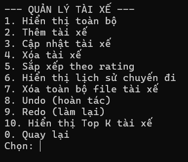
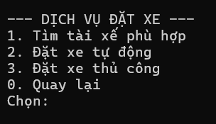
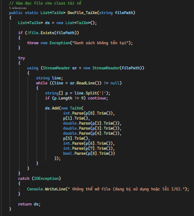
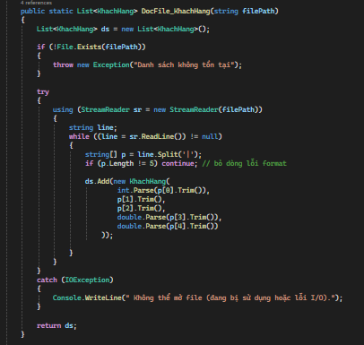
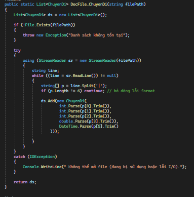
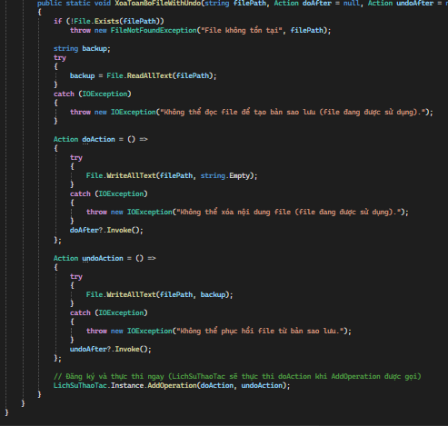
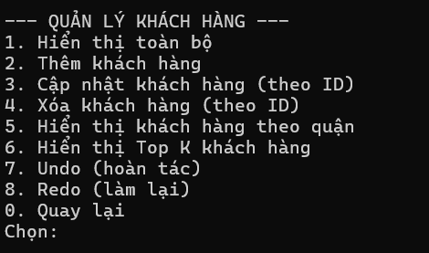
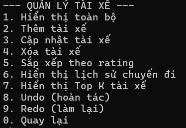
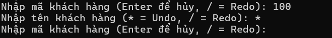
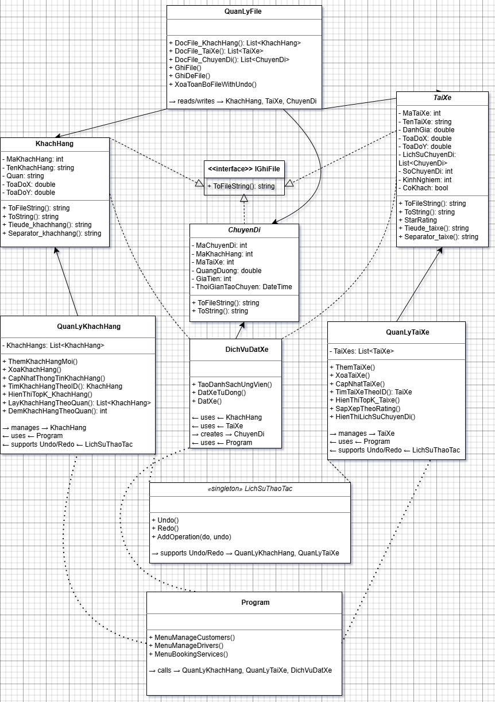

# 🚖 MinRide – Hệ thống đặt xe console (NOWCHALLENGE)

## Giới thiệu
MinRide là ứng dụng console viết bằng **C#** theo mô hình **OOP**.  
Hệ thống hỗ trợ quản lý khách hàng, tài xế, chuyến đi và dịch vụ đặt xe, đồng thời cung cấp chức năng **Undo/Redo thao tác**.  
Ứng dụng mô phỏng một hệ thống đặt xe đơn giản, nơi khách hàng có thể tìm tài xế phù hợp, đặt xe tự động hoặc thủ công, và quản lý lịch sử chuyến đi.

---
## 🖥️ Yêu cầu môi trường
- IDE: Visual Studio, Visual Studio Code(khuyến nghị Visual Studio).
## ▶️ Các bước chạy dự án 
1. Truy cập repo: [PrjDSA](https://github.com/trinhhaosft/PrjDSA.git)
2. Clone về máy bằng lệnh:
   ```bash
   git clone https://github.com/trinhhaosft/PrjDSA.git
-Sử dụng ctrl +F điền vào @ lần lượt sửa lại các đường dẫn file
-Tiến hành chạy chương trình
## 📂Các class chính

### IGhiFile (interface)
- Chuẩn hóa cách ghi dữ liệu ra file.
- Phương thức: `ToFileString()`
- Được triển khai bởi: `KhachHang`, `TaiXe`, `ChuyenDi`.

### KhachHang
- Thuộc tính: `MaKhachHang`, `TenKhachHang`, `Quan`, `ToaDoX`, `ToaDoY`.
- **Ví dụ dữ liệu đầu vào (khachhang.txt):**
1 | Nguyen Van An | Quan 1 | 5 | 8
2 | Tran Thi Binh | Quan 3 | 12 | 6
3 | Le Hoang Minh | Quan 5 | 7 | 14
6 | Dang Thi Mai | Quan Binh Thanh | 15 | 10
7 | Bui Anh Tuan | Quan Tan Binh | 18 | 7
8 | Nguyen Thi Hong | Quan Phu Nhuan | 13 | 9
9 | Tran Van Khoa | Quan 1 | 11 | 7
10 | Nguyen Thi Lan | Quan 3 | 14 | 5
11 | Pham Hoang Nam | Quan 5 | 6 | 12
12 | Le Thi Thu | Quan 7 | 19 | 16
13 | Vo Minh Tien | Quan 10 | 10 | 6
14 | Dang Van Phuc | Quan Binh Thanh | 17 | 11
15 | Bui Thi Hoa | Quan Tan Binh | 16 | 8
16 | Nguyen Van Duc | Quan Phu Nhuan | 12 | 10
17 | Nguyen Van Khang | Quan 1 | 10 | 6
18 | Tran Thi Thu | Quan 1 | 7 | 9
19 | Le Minh Quan | Quan 1 | 12 | 11
20 | Pham Thi Huong | Quan 3 | 9 | 8
### TaiXe
- Thuộc tính: `MaTaiXe`, `TenTaiXe`, `DanhGia`, `ToaDoX`, `ToaDoY`, `LichSuChuyenDi`, `SoChuyenDi`, `KinhNghiem`, `CoKhach`.
- **Ví dụ dữ liệu đầu vào (taixe.txt):**
1 | Nguyen Van Hung | 4,80165289256198 | 6 | 9 | driver_1 | 121 | 5 | False
2 | Tran Quoc Bao | 4,5 | 14 | 7 | driver_2 | 200 | 8 | False
3 | Le Thanh Phong | 4,9 | 8 | 15 | driver_3 | 350 | 10 | True
4 | Pham Duc Long | 4,2 | 21 | 17 | driver_4 | 90 | 3 | False
5 | Vo Minh Tuan | 3,9 | 10 | 5 | driver_5 | 60 | 2 | False
6 | Dang Hoang Nam | 4,7 | 16 | 11 | driver_6 | 180 | 6 | True
7 | Bui Tien Dat | 4,6 | 18 | 8 | driver_7 | 240 | 7 | False
8 | Nguyen Quang Huy | 5 | 13 | 10 | driver_8 | 400 | 12 | False

### ChuyenDi
- Thuộc tính: `MaChuyenDi`, `MaKhachHang`, `MaTaiXe`, `QuangDuong`, `GiaTien`, `ThoiGianTaoChuyen`.
- Được lưu trong file driver nếu chuyến xe được xác nhận đặt thành công.
2 | 4 | 15 | 5 | 60000 | 21/12/2025 11:40:52 SA
3 | 4 | 15 | 40 | 480000 | 21/12/2025 11:45:32 SA

### QuanLyKhachHang
- Quản lý danh sách khách hàng.
- Chức năng: thêm, xóa, cập nhật, lọc theo quận, xóa toàn bộ file khách hàng, top K khách hàng.
- Undo/Redo hỗ trợ bởi `LichSuThaoTac`.
[Menu quản lý khách hàng]


---

### QuanLyTaiXe
- Quản lý danh sách tài xế.
- Chức năng: thêm, xóa, cập nhật, sắp xếp theo rating, xem lịch sử chuyến đi, xóa toàn bộ file tài xế, top k tài xế.
- Undo/Redo hỗ trợ bởi `LichSuThaoTac`.
-  [Menu quản lý tài xế]
- 

---

### DichVuDatXe
- Chức năng: tìm tài xế phù hợp trong bán kính R, đặt xe tự động/thủ công.
- Liên kết với `KhachHang`, `TaiXe`, tạo `ChuyenDi`.
-[Dịch vụ đặt xe]


---

### QuanLyFile
- Chức năng: đọc/ghi file cho `KhachHang`, `TaiXe`, `ChuyenDi`.
- Hỗ trợ xóa file với Undo/Redo.
- [File dữ liệu] [Khách hàng](KhachHang.txt), [Tài xế](TaiXe.txt), [Chuyến đi](Drive.txt>)



---

### LichSuThaoTac (Singleton)
- Quản lý Undo/Redo.
- Phương thức: `AddOperation(do, undo)`, `Undo()`, `Redo()`.
- **Ghi chú UML:** «singleton»
-Dùng hoàn tác hay tiến tới thao tác đang thực hiện 
 
Và cũng như ở các thao tác 


---

### Program
- Menu chính: `MenuManageCustomers()`, `MenuManageDrivers()`, `MenuBookingServices()`.
- Gọi các class quản lý để điều khiển toàn bộ hệ thống.
## ▶️ Menu chính
Khi chạy chương trình, hệ thống hiển thị menu chính như sau:.


---

## UML Class Diagram
- `KhachHang`, `TaiXe`, `ChuyenDi` implements `IGhiFile`.
- `QuanLyKhachHang` quản lý `KhachHang`.
- `QuanLyTaiXe` quản lý `TaiXe`.
- `DichVuDatXe` sử dụng `KhachHang`, `TaiXe`, tạo `ChuyenDi`.
- `QuanLyFile` đọc/ghi dữ liệu cho tất cả.
- `LichSuThaoTac` hỗ trợ Undo/Redo cho `QuanLyKhachHang` và `QuanLyTaiXe`.
- `Program` gọi menu để điều khiển toàn bộ hệ thống.

- [UML Class Diagram]
  

- Chú thích:
- 1. KhachHang, TaiXe, ChuyenDi → IGhiFile
Mũi tên implements (nét đứt, tam giác rỗng) từ 3 class này trỏ lên IGhiFile.
- 2. QuanLyKhachHang → KhachHang
Mũi tên association (nét liền) từ QuanLyKhachHang trỏ sang KhachHang (ý nghĩa: quản lý danh sách khách hàng).
- 3. QuanLyTaiXe → TaiXe
Mũi tên association (nét liền) từ QuanLyTaiXe trỏ sang TaiXe (ý nghĩa: quản lý danh sách tài xế).
- 4. DichVuDatXe → KhachHang, TaiXe
Mũi tên dependency (nét chấm) từ DichVuDatXe trỏ sang KhachHang và TaiXe (ý nghĩa: dịch vụ đặt xe sử dụng thông tin khách hàng và tài xế).
- 5. DichVuDatXe → ChuyenDi
Mũi tên association (nét liền) từ DichVuDatXe trỏ sang ChuyenDi (ý nghĩa: dịch vụ đặt xe tạo ra chuyến đi).
- 6. QuanLyFile → KhachHang, TaiXe, ChuyenDi
Mũi tên association (nét liền) từ QuanLyFile trỏ sang 3 class này (ý nghĩa: đọc/ghi dữ liệu cho chúng).
- 7. LichSuThaoTac → QuanLyKhachHang, QuanLyTaiXe
Mũi tên dependency (nét chấm) từ LichSuThaoTac trỏ sang QuanLyKhachHang và QuanLyTaiXe (ý nghĩa: hỗ trợ Undo/Redo cho hai class này).
- 8. Program → QuanLyKhachHang, QuanLyTaiXe, DichVuDatXe
Mũi tên dependency (nét chấm) từ Program trỏ sang 3 class này (ý nghĩa: Program gọi menu để điều khiển).


